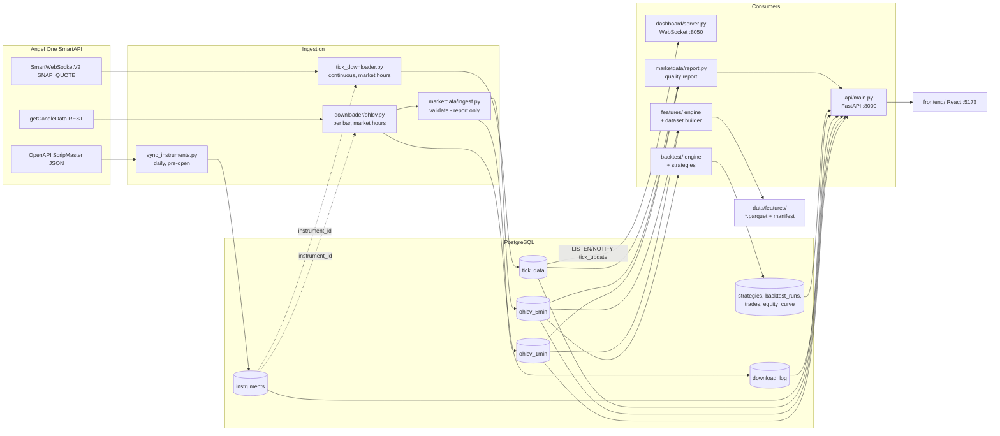

# Architecture

A description of the HereWeGoAgain system **as it exists in this repository**.
Nothing here is aspirational: every component named below has a file behind it.

Phase 1 added exactly one new component (`marketdata/`, plus a read-only
`/quality` API route). Phase 2 added the `features/` package. Everything else
described here predates Phase 1 unless noted.

---

## System overview

HereWeGoAgain is an Indian market-data platform built around a single
PostgreSQL database. Long-lived processes (defined in `docker-compose.yml`)
read from or write to that database; there is no message bus, no job queue and
no service-to-service RPC — the database *is* the integration point.

| Component | Entry point | Role |
|---|---|---|
| Instrument sync | `scheduler/instrument_sync_scheduler.py` → `downloader/sync_instruments.py` | Once per trading day before open: download the Angel One instrument master, upsert `instruments`, deactivate expired contracts, activate the current Nifty ATM option set. |
| OHLCV scheduler | `scheduler/ohlcv_scheduler.py` → `downloader/ohlcv.py` | During market hours: submit a 1-minute download every trading minute and a 5-minute download on each 5-minute boundary. |
| Tick downloader | `downloader/tick_downloader.py` | Holds an Angel One `SmartWebSocketV2` SNAP_QUOTE subscription for the session and batch-inserts snapshots into `tick_data`. |
| Retention scheduler | `scheduler/retention_scheduler.py` | Daily at `RETENTION_RUN_TIME` (default 16:30 IST): archive ticks older than `TICK_RETENTION_DAYS` (default 7) to compressed Parquet, verify, then delete them from `tick_data`. |
| REST API | `api/main.py` (FastAPI, port 8000) | Read endpoints for instruments, OHLCV, ticks, volatility, download status, strategies, data quality; two write endpoints behind `X-API-Key`. |
| Live dashboard | `dashboard/server.py` (FastAPI, port 8050) | Order-book/L2 dashboard. Pushes over a WebSocket, woken by PostgreSQL `LISTEN/NOTIFY` on `tick_update` rather than polling. |
| React frontend | `frontend/` (Vite, port 5173) | Dashboard, OHLCV chart, volatility and strategies pages. |

Configuration is entirely environment variables, loaded with `python-dotenv`
from a `.env` file that is git-ignored. `db/connection.py` resolves either
`DATABASE_URL` or the individual `DB_*` / `POSTGRES_*` variables.

There is no ORM and no migration tool: `db/init_schema.sql` is an idempotent
bootstrap script run by hand against a fresh database. Incremental schema changes
live in `db/migrations/`.

### Deployment environment

- **Windows host, PowerShell primary.** Postgres runs **natively on Windows**,
  not in Docker — `docker-compose.yml` deliberately has no `postgres-db`
  service and the containers reach the host DB via `host.docker.internal`.
- Credentials live in `.env` (gitignored).

### Services in practice

Compose defines 7 services. In practice only the 4 schedulers run continuously:

- **Running:** `market-tick-downloader`, `market-ohlcv-scheduler`,
  `market-instrument-sync-scheduler` (08:45 daily),
  `market-retention-scheduler` (16:30 daily, keeps 7 days of ticks)
- **Usually stopped:** `api-server` (:8000), `dashboard-server` (:8050),
  `react-frontend` (:5173) — these are the read path, not ingestion.
- `my-redis` is a **stale container unrelated to this project**. Nothing in the
  codebase references Redis. Do not treat it as a broken dependency.

---

## Data flow



Notable properties of the existing flow:

* **Incremental and idempotent.** `downloader/ohlcv.py` resumes from
  `MAX(timestamp)` in the target table (not from `download_log`, so a partial
  run recovers correctly) and every insert is
  `ON CONFLICT (instrument_id, timestamp) DO NOTHING`. Re-running a download
  never duplicates a bar and never overwrites one.
* **Resolution happens once.** The feed speaks in tokens; `instrument_id` is
  resolved from `instruments` at ingestion time and is the only identifier the
  rest of the system uses.
* **No transformation layer.** Bars are written exactly as the API returns
  them, apart from timestamp normalisation. Tick prices are divided by 100
  (the feed sends paise); no other arithmetic is applied on ingest.
* **The only push path** is `tick_data` → PostgreSQL trigger `notify_new_tick`
  → `pg_notify('new_tick')` / explicit `NOTIFY tick_update` → dashboard
  WebSocket.

---

## Data sources

All market data comes from **Angel One SmartAPI** (`smartapi-python==1.5.5`).
There is exactly one vendor; there is no cross-source reconciliation.

| Dataset | Endpoint | Called by | Cadence |
|---|---|---|---|
| Instrument master | `https://margincalculator.angelbroking.com/OpenAPI_File/files/OpenAPIScripMaster.json` (~145k rows) | `downloader/sync_instruments.py` | Once daily, at/after `INSTRUMENT_SYNC_TIME` (default 08:45 IST) |
| Historical candles | `SmartConnect.getCandleData` with `ONE_MINUTE` / `FIVE_MINUTE` | `downloader/ohlcv.py` | 1m every market minute, 5m every 5-minute boundary, `+OHLCV_BAR_DELAY_SECONDS` (default 10s) after the boundary |
| Live snapshots | `SmartWebSocketV2`, mode 3 (SNAP_QUOTE) | `downloader/tick_downloader.py` | Continuous during the session |
| Spot LTP | `SmartConnect.ltpData` | `sync_instruments.py`, `tick_downloader.py` | On demand, to compute the ATM strike |

Authentication is TOTP-based (`ANGEL_API_KEY`, `ANGEL_CLIENT_ID`,
`ANGEL_PASSWORD`, `ANGEL_TOTP_TOKEN`) with 5 retries and exponential backoff.
Candle fetches retry on error code `AB1004` (rate limit) with the same
backoff (2→4→8→16s). Fetches are chunked at `CHUNK_DAYS = 5` with a 2-second
inter-call delay.

Scope of what is actually collected: instrument types `AMXIDX`, `FUTIDX`,
`OPTIDX`, names `NIFTY, BANKNIFTY, SENSEX, BANKEX` (all configurable), plus
whatever Nifty options the daily sync activated around the ATM strike.

### Instrument coverage — 49 vs 29

Two different subscription windows, both intentional:

- **OHLCV sweep** covers all **49** active instruments — 4 spot indices
  (Nifty 50, Nifty Bank, SENSEX, BANKEX), 3 Nifty futures, and 42 options
  (ATM ±10 strikes, CE+PE at 50-point steps).
- **Tick downloader** subscribes to **29** — ATM ±5 strikes plus indices and
  futures. See the `num_strikes=5` argument in `downloader/tick_downloader.py`.

A tick/OHLCV instrument-count mismatch is therefore expected, not a fault.

The option chain **re-centres on ATM every morning at 08:45**, so the active
strike set rotates with spot. Cross-day analysis pinned to a fixed strike will
hit gaps by design.

### Angel One rate limiting

Throttling of the OHLCV sweep is routine and mostly cosmetic: retries absorb it,
and sweeps still complete with 0 failures. It costs *latency* — sweeps intended
to take ~50s can take ~6 minutes, so 1m candles land in bursts and runs collide
(`Skipping 1m run: previous run is still active`). That matters only if you need
candles in near-real-time; end-of-day backtesting is unaffected.

Contrast with the tick downloader path: on restart, `generateSession` retries
roughly 2s apart with **no backoff**, which can trip Angel One's login rate limit
(`DataException: Access denied because of exceeding access rate`) exactly when
it's trying to recover.

---

## Storage

**Engine:** PostgreSQL. In the default `docker-compose.yml` the containers do
*not* run their own database — they connect to a host Postgres instance via
`host.docker.internal`. Schema bootstrap is `psql "$DATABASE_URL" -f
db/init_schema.sql` (every statement is `IF NOT EXISTS`).

| Table | Contents | Key | Indexes |
|---|---|---|---|
| `instruments` | Instrument master; `is_active` marks the currently-tracked set | `UNIQUE(token, exchange)` | `instrument_type`, `exchange` |
| `ohlcv_1min` | 1-minute bars | `UNIQUE(instrument_id, timestamp)` | `(instrument_id, timestamp DESC)`, `(timestamp DESC)` |
| `ohlcv_5min` | 5-minute bars | `UNIQUE(instrument_id, timestamp)` | `(instrument_id, timestamp DESC)`, `(timestamp DESC)` |
| `tick_data` | SNAP_QUOTE snapshots incl. best-5 book as `JSONB` | `UNIQUE(instrument_id, timestamp, sequence_number)` | `(instrument_id, timestamp DESC)`, `(timestamp DESC)` |
| `download_log` | One row per instrument per download run | — | `instrument_id`, `status`, `last_run_at DESC` |
| `strategies`, `backtest_runs`, `trades`, `equity_curve` | Backtest simulation results. `trades.is_paper` remains as a discriminator, but nothing writes `TRUE` rows since the paper-trading feature was removed. | see `db/init_schema.sql` | per-table |

* **Partitioning:** none. `ohlcv_1min`, `ohlcv_5min` and `tick_data` are plain
  heap tables; growth is managed only by what the schedulers choose to fetch.
* **Retention:** tick data only, via `market-retention-scheduler` (default 7
  days). OHLCV bars for expired option contracts are deliberately kept — their
  history stays valid.
* **Numeric types:** bars use `DECIMAL(12,4)` for prices and `BIGINT` for
  volume; ticks use `DECIMAL(12,2)`. psycopg2 returns these as `Decimal`.
* **Timestamps:** every timestamp column is `TIMESTAMP` — i.e. *without* time
  zone. See [02-market-data.md — Point-in-time semantics](02-market-data.md#point-in-time-semantics)
  for what that implies.
* **Naming:** snake_case tables and columns; `id` surrogate keys; `_1min` /
  `_5min` table suffixes; the short labels `1m` / `5m` appear in code
  (`downloader/ohlcv.py: INTERVALS`) and in `marketdata`.
* **Trigger:** `notify_new_tick` fires `pg_notify('new_tick', row_to_json(NEW))`
  after every `tick_data` insert; the tick downloader additionally issues
  `NOTIFY tick_update` per batch.

Local files: `data/` (instrument-master CSV exports, feature datasets) and
`logs/` are both git-ignored and are not part of the ingestion data path.

### Join key

`ohlcv_1min.instrument_id` / `ohlcv_5min.instrument_id` /
`tick_data.instrument_id` reference **`instruments.id`**, not
`instruments.token` and not a column named `instrument_id` — `instruments` has
no such column. Joining on the wrong one errors out immediately.

`timestamp` columns are `timestamp without time zone` holding **IST**. Tick
timestamps are converted through an explicit IST offset in code; the containers
also set `TZ=Asia/Kolkata`, which is belt-and-braces rather than load-bearing.

### Schema summary

Field-by-field semantics — including which fields come from the feed and which
are produced locally — are in **[02-market-data.md — Data contracts](02-market-data.md#data-contracts)**,
and encoded executably in `marketdata/contracts.py` (a test asserts the two match
`db/init_schema.sql`). In brief:

**`tick_data`** — `instrument_id`, `timestamp`, `sequence_number`, `ltp`, `ltq`,
day `open`/`high`/`low`, `close` (previous day's close), `avg_trade_price`,
cumulative `volume`, `total_buy_qty`, `total_sell_qty`, `open_interest`,
`best_5_buy`/`best_5_sell` (`JSONB`), `created_at`.

**`ohlcv_1min` / `ohlcv_5min`** — identical shape: `instrument_id`,
`timestamp` (bar start), `open`, `high`, `low`, `close`, `volume`,
`created_at`.

---

## Operational notes

### Session health

- Session is **09:15–15:30 IST**. A full day is ~375 one-minute candles.
- Low candle counts on deep-OTM strikes are **genuine no-trade minutes**, not
  lost data. Judge health by `download_log` status, not by candle count alone:
  `SELECT status, count(*) FROM download_log WHERE last_run_at::date = CURRENT_DATE GROUP BY status;`
  `no_data` is a normal outcome; `success` with 0 failures is the healthy shape.
- `min(timestamp)` on a day is **not** the session start. Pre-open prints appear
  at 09:10 (SENSEX/BANKEX, volume 0, open == close) and 09:14 (a Nifty index
  print). Filter to `>= '09:15'` when you mean the open.

### Container logs

`docker logs` **persists across restarts**, so a bare
`docker logs <c> | grep -c ERROR` counts history from previous days and badly
overstates today. Always scope it:

```bash
docker logs --since <container-StartedAt> <container> 2>&1 | grep -ciE "traceback|exception|ERROR"
docker inspect <container> --format '{{.State.StartedAt}} restarts={{.RestartCount}}'
```

`RestartCount` is the fastest signal that something is wrong — the schedulers
normally sit at 0.

### Known fragility: the tick downloader

`market-tick-downloader` is the least reliable service and has two distinct
failure modes, both observed on 2026-09-11 (12 restarts, 2h34m of ticks lost):

1. The overnight websocket reconnect loop can hit
   `Max retry attempts reached`, die silently, and **not recover by the open** —
   producing no log output at all until something restarts it.
2. On restart, `generateSession` retries roughly 2s apart with **no backoff**,
   which trips Angel One's login rate limit
   (`DataException: Access denied because of exceeding access rate`) exactly
   when it's trying to recover.

Ticks lost this way are **unrecoverable** — the feed is websocket-only. OHLCV is
REST-backfilled and does recover the same window, so a tick gap usually leaves
candle data intact. Check both before concluding a day is lost.

---

## Testing, linting and CI

### Current state (post Phase 2)

```bash
pip install -r requirements-dev.txt
python -m pytest
```

**577 passed, 1 skipped** (~6 s). The suite needs **no database and no
network** — `pytest` is the only dev dependency. If a test wants a live DB or an
Angel One session, that's a bug in the test.

`marketdata/` is stdlib-only outright. `features/` is stdlib-only except
`features/store.py`, which imports `pandas` and `pyarrow` *inside* the two
functions that read and write Parquet — so the contract, engine and registry
still import on a bare interpreter, and only dataset I/O needs the runtime
requirements. Neither package added a dependency: `pandas` and `pyarrow` were
already in `requirements.txt` for the API and the retention archiver.

### Pre-Phase-1 baseline

* **Tests:** none existed before Phase 1. There was no `tests/` directory, no
  `pytest.ini`/`pyproject.toml`/`setup.cfg`, and no test runner configured.
* **Linting / type checking:** no configuration of any kind (no flake8, ruff,
  black, mypy or pyright config).
* **CI:** none. There is no `.github/` directory.
* **Containerisation:** `Dockerfile` (Python 3.11-slim, one image reused by all
  Python services) and `docker-compose.yml` (7 services). `.dockerignore`
  excludes `tests/`, so the test suite does not affect image builds.
