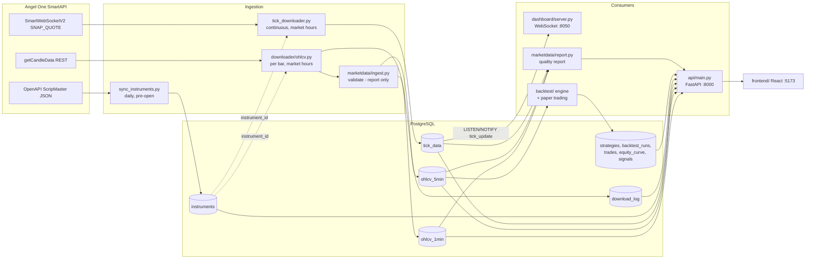

# Current Architecture

A description of the HereWeGoAgain system **as it exists in this repository**,
written at the start of Phase 1. Nothing here is aspirational: every component
named below has a file behind it.

Phase 1 added exactly one new component (`marketdata/`, plus a read-only
`/quality` API route). Everything else described here predates it.

---

## 3.1 System overview

HereWeGoAgain is an Indian market-data platform built around a single
PostgreSQL database. Six long-lived processes (defined in `docker-compose.yml`)
read from or write to that database; there is no message bus, no job queue and
no service-to-service RPC — the database *is* the integration point.

| Component | Entry point | Role |
|---|---|---|
| Instrument sync | `scheduler/instrument_sync_scheduler.py` → `downloader/sync_instruments.py` | Once per trading day before open: download the Angel One instrument master, upsert `instruments`, deactivate expired contracts, activate the current Nifty ATM option set. |
| OHLCV scheduler | `scheduler/ohlcv_scheduler.py` → `downloader/ohlcv.py` | During market hours: submit a 1-minute download every trading minute and a 5-minute download on each 5-minute boundary. |
| Tick downloader | `downloader/tick_downloader.py` | Holds an Angel One `SmartWebSocketV2` SNAP_QUOTE subscription for the session and batch-inserts snapshots into `tick_data`. |
| REST API | `api/main.py` (FastAPI, port 8000) | Read endpoints for instruments, OHLCV, ticks, volatility, download status, strategies, paper trading, data quality; two write endpoints behind `X-API-Key`. |
| Live dashboard | `dashboard/server.py` (FastAPI, port 8050) | Order-book/L2 dashboard. Pushes over a WebSocket, woken by PostgreSQL `LISTEN/NOTIFY` on `tick_update` rather than polling. |
| Paper trading | `scheduler/paper_trading_scheduler.py` → `backtest/` | Evaluates `rv_breakout` and `vrp_reversion` once per 5-minute bar; writes simulated `trades` / `equity_curve` / `signals`. No real orders. |
| React frontend | `frontend/` (Vite, port 5173) | Dashboard, OHLCV chart, volatility, strategies, paper-trading pages. |

Configuration is entirely environment variables, loaded with `python-dotenv`
from a `.env` file that is git-ignored. `db/connection.py` resolves either
`DATABASE_URL` or the individual `DB_*` / `POSTGRES_*` variables.

There is no ORM and no migration tool: `db/init_schema.sql` is an idempotent
bootstrap script run by hand against a fresh database.

---

## 3.2 Data flow

Notable properties of the existing flow:

* **Incremental and idempotent.** `downloader/ohlcv.py` resumes from
  `MAX(timestamp)` in the target table (not from `download_log`, so a partial
  run recovers correctly) and every insert is
  `ON CONFLICT (instrument_id, timestamp) DO NOTHING`. Re-running a download
  never duplicates a bar and never overwrites one.
* **Resolution happens once.** The feed speaks in tokens; `instrument_id` is
  resolved from `instruments` at ingestion time and is the only identifier the
  rest of the system uses.
* **No transformation layer.** Bars are written exactly as the API returns
  them, apart from timestamp normalisation. Tick prices are divided by 100
  (the feed sends paise); no other arithmetic is applied on ingest.
* **The only push path** is `tick_data` → PostgreSQL trigger `notify_new_tick`
  → `pg_notify('new_tick')` / explicit `NOTIFY tick_update` → dashboard
  WebSocket.

---

## 3.3 Existing data sources

All market data comes from **Angel One SmartAPI** (`smartapi-python==1.5.5`).
There is exactly one vendor; there is no cross-source reconciliation.

| Dataset | Endpoint | Called by | Cadence |
|---|---|---|---|
| Instrument master | `https://margincalculator.angelbroking.com/OpenAPI_File/files/OpenAPIScripMaster.json` (~145k rows) | `downloader/sync_instruments.py` | Once daily, at/after `INSTRUMENT_SYNC_TIME` (default 08:45 IST) |
| Historical candles | `SmartConnect.getCandleData` with `ONE_MINUTE` / `FIVE_MINUTE` | `downloader/ohlcv.py` | 1m every market minute, 5m every 5-minute boundary, `+OHLCV_BAR_DELAY_SECONDS` (default 10s) after the boundary |
| Live snapshots | `SmartWebSocketV2`, mode 3 (SNAP_QUOTE) | `downloader/tick_downloader.py` | Continuous during the session |
| Spot LTP | `SmartConnect.ltpData` | `sync_instruments.py`, `tick_downloader.py` | On demand, to compute the ATM strike |

Authentication is TOTP-based (`ANGEL_API_KEY`, `ANGEL_CLIENT_ID`,
`ANGEL_PASSWORD`, `ANGEL_TOTP_TOKEN`) with 5 retries and exponential backoff.
Candle fetches retry on error code `AB1004` (rate limit) with the same
backoff. Fetches are chunked at `CHUNK_DAYS = 5` with a 2-second inter-call
delay.

Scope of what is actually collected: instrument types `AMXIDX`, `FUTIDX`,
`OPTIDX`, names `NIFTY, BANKNIFTY, SENSEX, BANKEX` (all configurable), plus
whatever Nifty options the daily sync activated around the ATM strike.

---

## 3.4 Storage

**Engine:** PostgreSQL. In the default `docker-compose.yml` the containers do
*not* run their own database — they connect to a host Postgres instance via
`host.docker.internal`. Schema bootstrap is `psql "$DATABASE_URL" -f
db/init_schema.sql` (every statement is `IF NOT EXISTS`).

| Table | Contents | Key | Indexes |
|---|---|---|---|
| `instruments` | Instrument master; `is_active` marks the currently-tracked set | `UNIQUE(token, exchange)` | `instrument_type`, `exchange` |
| `ohlcv_1min` | 1-minute bars | `UNIQUE(instrument_id, timestamp)` | `(instrument_id, timestamp DESC)`, `(timestamp DESC)` |
| `ohlcv_5min` | 5-minute bars | `UNIQUE(instrument_id, timestamp)` | `(instrument_id, timestamp DESC)`, `(timestamp DESC)` |
| `tick_data` | SNAP_QUOTE snapshots incl. best-5 book as `JSONB` | `UNIQUE(instrument_id, timestamp)` | `(instrument_id, timestamp DESC)`, `(timestamp DESC)` |
| `download_log` | One row per instrument per download run | — | `instrument_id`, `status`, `last_run_at DESC` |
| `strategies`, `backtest_runs`, `trades`, `equity_curve`, `signals` | Simulation results (backtest and paper trading share one representation) | see `db/init_schema.sql` | per-table |

* **Partitioning:** none. `ohlcv_1min`, `ohlcv_5min` and `tick_data` are plain
  heap tables; growth is managed only by what the schedulers choose to fetch.
* **Retention:** none. Nothing is ever deleted or archived, including bars for
  expired option contracts (deliberately — their history stays valid).
* **Numeric types:** bars use `DECIMAL(12,4)` for prices and `BIGINT` for
  volume; ticks use `DECIMAL(12,2)`. psycopg2 returns these as `Decimal`.
* **Timestamps:** every timestamp column is `TIMESTAMP` — i.e. *without* time
  zone. See `docs/point-in-time-data.md` for what that implies.
* **Naming:** snake_case tables and columns; `id` surrogate keys; `_1min` /
  `_5min` table suffixes; the short labels `1m` / `5m` appear in code
  (`downloader/ohlcv.py: INTERVALS`) and now in `marketdata`.
* **Trigger:** `notify_new_tick` fires `pg_notify('new_tick', row_to_json(NEW))`
  after every `tick_data` insert; the tick downloader additionally issues
  `NOTIFY tick_update` per batch.

Local files: `data/` (instrument-master CSV exports) and `logs/` are both
git-ignored and are not part of the data path.

---

## 3.5 Current data schemas

Field-by-field semantics — including which fields come from the feed and which
are produced locally — are in **`docs/data-contract.md`**, and encoded
executably in `marketdata/contracts.py` (a test asserts the two match
`db/init_schema.sql`). In brief:

**`tick_data`** — `instrument_id`, `timestamp`, `ltp`, `ltq`, day
`open`/`high`/`low`, `close` (previous day's close), `avg_trade_price`,
cumulative `volume`, `total_buy_qty`, `total_sell_qty`, `open_interest`,
`best_5_buy`/`best_5_sell` (`JSONB`), `created_at`.

**`ohlcv_1min` / `ohlcv_5min`** — identical shape: `instrument_id`,
`timestamp` (bar start), `open`, `high`, `low`, `close`, `volume`,
`created_at`.

---

## Testing, linting and CI as found

* **Tests:** none existed before Phase 1. There was no `tests/` directory, no
  `pytest.ini`/`pyproject.toml`/`setup.cfg`, and no test runner configured.
* **Linting / type checking:** no configuration of any kind (no flake8, ruff,
  black, mypy or pyright config).
* **CI:** none. There is no `.github/` directory.
* **Containerisation:** `Dockerfile` (Python 3.11-slim, one image reused by all
  Python services) and `docker-compose.yml` (7 services). `.dockerignore`
  excludes `tests/`, so the test suite does not affect image builds.
